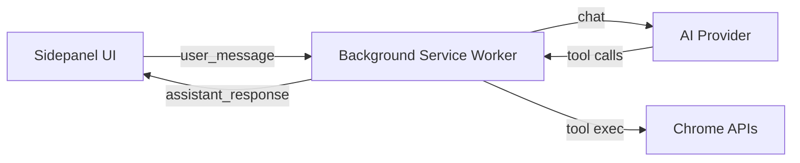
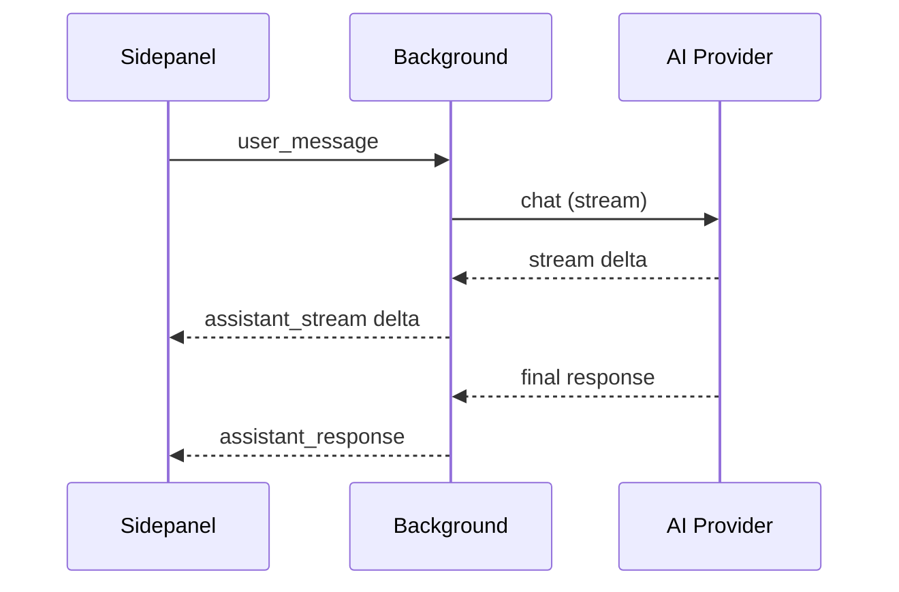

# Parchi

Parchi is a browser sidepanel extension for AI-powered browsing assistance. It pairs a chat UI with tool-driven browser automation so you can navigate, read, and act on pages without leaving your workflow.

## What it does

- Chat-driven browser automation with tool execution
- Inline tool-call timeline + reasoning during streaming
- Session history and profile-driven settings

## Architecture

## Streaming flow

## Quality

Last verified: 2026-01-21

| Check | Command | Result |
| --- | --- | --- |
| Unit tests | `npm run test:unit` | 31/31 passing |

## Development

- `npm install`
- `npm run build`
- Load the unpacked extension from `dist/` in Chrome
- For Firefox: `npm run build:firefox`, then load `dist/` via `about:debugging#/runtime/this-firefox`
- For a Firefox XPI: `npm run build:firefox:xpi` (outputs `dist/parchi-<version>.xpi`; requires Developer Edition/Nightly or add-on signing for release)

## Relay (Daemon + CLI)

The relay exposes the extension as a local automation endpoint (tools mode) and as an in-browser agent runner (agent mode).

1. Start the daemon:
   - `PARCHI_RELAY_TOKEN=your-secret npm run build`
   - `PARCHI_RELAY_TOKEN=your-secret npm run relay:daemon`
2. In the extension Settings, open the `Relay` section:
   - Enable Relay
   - Set Relay URL to `http://127.0.0.1:17373`
   - Set Relay Token to the same `PARCHI_RELAY_TOKEN`
3. Use the CLI:
   - List agents: `PARCHI_RELAY_TOKEN=your-secret npm run relay -- agents`
   - List tools: `PARCHI_RELAY_TOKEN=your-secret npm run relay -- tools`
   - Call a tool: `PARCHI_RELAY_TOKEN=your-secret npm run relay -- tool navigate --args='{\"url\":\"https://example.com\"}'`
   - Run the agent and wait: `PARCHI_RELAY_TOKEN=your-secret npm run relay -- run \"Open example.com and summarize the page\"`
