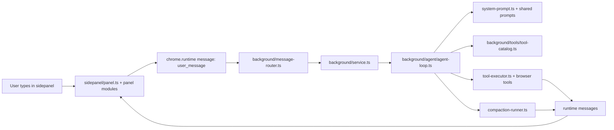

# Agent pipeline

This is the current runtime path for Parchi inside the browser extension.

## High-level flow

## Main entrypoints

### UI

- `packages/extension/sidepanel/panel.ts`
- `packages/extension/sidepanel/ui/panel-modules.ts`
- `packages/extension/sidepanel/ui/core/panel-ui.ts`

What they do:

- bootstrap the sidepanel
- compose the prototype-augmented UI modules
- hold long-lived session state like:
  - `displayHistory`
  - `contextHistory`
  - `historyTurnMap`
  - `toolCallViews`
  - `reportImages`

### Background

- `packages/extension/background/message-router.ts`
- `packages/extension/background/service.ts`
- `packages/extension/background/session-manager.ts`

What they do:

- receive sidepanel/runtime messages
- resolve per-session state
- route work into the agent loop, relay, screenshots, and tool execution

### Agent loop

- `packages/extension/background/agent/agent-loop.ts`
- `agent-loop-prepare.ts`
- `agent-loop-model-pass.ts`
- `agent-loop-response.ts`
- `response-materializer.ts`

What they do:

- build provider-ready history
- choose a model/profile
- run the model pass
- normalize model output into:
  - assistant content
  - tool calls
  - plan updates
  - compaction triggers

### Tool execution

- `packages/extension/background/tools/tool-catalog.ts`
- `packages/extension/background/tools/tool-executor.ts`
- `packages/extension/tools/`

What they do:

- decide which tools are exposed
- execute browser/read/tab/video/report/subagent actions
- postprocess results into normalized runtime events

## Runtime message contract

Shared schema:

- `packages/shared/src/runtime-message-definitions.ts`
- `packages/shared/src/runtime-messages.ts`

Important message families:

- streaming text/reasoning updates
- tool start / tool result
- plan updates
- compaction events
- run completion / run error

This contract is the backbone between:

- background worker
- sidepanel UI
- relay surfaces

## Context and compaction

Relevant files:

- `packages/extension/sidepanel/ui/chat/panel-context.ts`
- `packages/extension/background/agent/compaction-*.ts`
- `packages/extension/sidepanel/ui/core/panel-session-memory.ts`

Current rules that matter:

- `displayHistory` is UI-facing and bounded separately from `contextHistory`
- `contextHistory` is the richer model-facing transcript and must be clamped on every append/replay path
- compaction replaces older context with summaries when token usage climbs

## Memory-sensitive UI state

These are the main long-lived sidepanel structures to watch during profiling:

| Structure | Purpose | Current guardrail |
| --- | --- | --- |
| `contextHistory` | model transcript | shared clamp helper |
| `historyTurnMap` | rich turn + tool-event trace | bounded turn/event caps |
| `toolCallViews` | tool timeline DOM/view state | capped count + explicit cleanup |
| `reportImages` | screenshot/report image cache | count/byte caps + blob revoke + fallback eviction |

If memory rises for long Firefox sessions, inspect these first before blaming the model/provider path.

## Relay and Electron path

Relay path:

- `packages/relay-service/`
- `packages/cli/`

Electron path:

- `packages/electron-agent/`

Both sit beside the extension runtime rather than replacing it. They reuse the same shared contracts and tool surface where possible.

## Practical debugging order

1. **UI symptom**  
   Check sidepanel state/rendering modules first.

2. **Runtime event mismatch**  
   Check `runtime-message-definitions.ts`, `message-router.ts`, and `panel-core.ts`.

3. **Tool not exposed or blocked**  
   Check `tool-catalog.ts`, `tool-permissions.ts`, and `tool-executor.ts`.

4. **Context blow-up / compaction weirdness**  
   Check `panel-context.ts`, `panel-session-memory.ts`, and `background/agent/compaction-*.ts`.

5. **Perf regression**  
   Run `npm run perf:tabs` and use [`tab-process-performance-playbook.md`](./tab-process-performance-playbook.md).
