# Relay Validation + Benchmarking

This document covers:
1. How relay request/response flow works
2. What validation is enforced
3. How to benchmark Parchi relay latency
4. How to compare Parchi against external tools (e.g., Claude in Chrome)

## 1) Relay flow (high-level)

```mermaid
flowchart LR
  A["parchi-relay CLI"] --> B["relay-daemon (/v1/rpc)"]
  B --> C["extension relay bridge (WebSocket)"]
  C --> D["background service handleRelayRpc(agent.run)"]
  D --> E["processUserMessage"]
  E --> F["resolveRuntimeModelProfile + resolveLanguageModel"]
  F --> G["streamText/generateText"]
  G --> H["sendRuntime events"]
  H --> I["relay-daemon run.event + run.done"]
  I --> J["run.wait / run.events"]
```



Primary files:
- `packages/extension/background/service.ts`
- `packages/extension/relay/relay-bridge.ts`
- `packages/relay-service/src/relay-daemon.ts`
- `packages/shared/src/runtime-messages.ts`

## 2) Validation now enforced

`agent.run` relay RPC now validates:
- `params` must be an object
- `prompt` is required and capped (20,000 chars)
- `sessionId` format and max length (120 chars)
- `selectedTabIds` (if present) must be an array of positive integer IDs and max 25

This is implemented in:
- `packages/extension/background/service.ts` (`validateRelayRunParams`)

## 3) Runtime latency instrumentation

Runtime messages now include optional benchmark fields on terminal events:
- `latency`: `runStartAt`, `completedAt`, `totalMs`, `ttfbMs`, `firstTokenMs`, `stream`, `modelAttempts`
- `benchmark`: `success`, `provider`, `model`, `route`, optional `errorCategory`

Emitted on:
- `assistant_final`
- `run_error`

`user_run_start` is emitted at run start to strengthen event-sequence validation.

Type definitions:
- `packages/shared/src/runtime-messages.ts`

## 4) Relay benchmark runner

Script:
- `tests/relay/run-relay-benchmark.ts`

Build + run:

```bash
npm run build
PARCHI_RELAY_TOKEN=... npm run bench:relay
```

Optional flags:

```bash
PARCHI_RELAY_TOKEN=... \
node dist/tests/relay/run-relay-benchmark.js \
  --host=127.0.0.1 \
  --port=17373 \
  --rounds=12 \
  --timeoutMs=240000 \
  --label=parchi-relay-main \
  --prompts="Prompt A|Prompt B|Prompt C"
```

Artifacts:
- `test-output/relay/relay-benchmark-<timestamp>.json`
- `test-output/relay/relay-benchmark-<timestamp>.md`

## 5) External comparison protocol (Claude extension, others)

Use the same prompt set and run count across tools.

Recommended test plan:
1. Freeze prompt list (10–20 prompts, mixed short/medium)
2. Run each tool in same network conditions and time window
3. Capture per-run:
   - total completion latency
   - first visible token latency (if measurable)
   - success/failure
4. Compare:
   - success rate
   - p50/p95 total latency
   - p50/p95 first-token latency

For Parchi, use relay benchmark JSON directly.
For external tools, record equivalent fields in a companion JSON and compare side-by-side in your analysis notebook/report.

## 6) What this gives you

- Deterministic relay validation before run execution
- Structured terminal metrics for every run
- Reproducible benchmark artifacts under `test-output/relay`
- A stable protocol for apples-to-apples comparisons against external assistants
